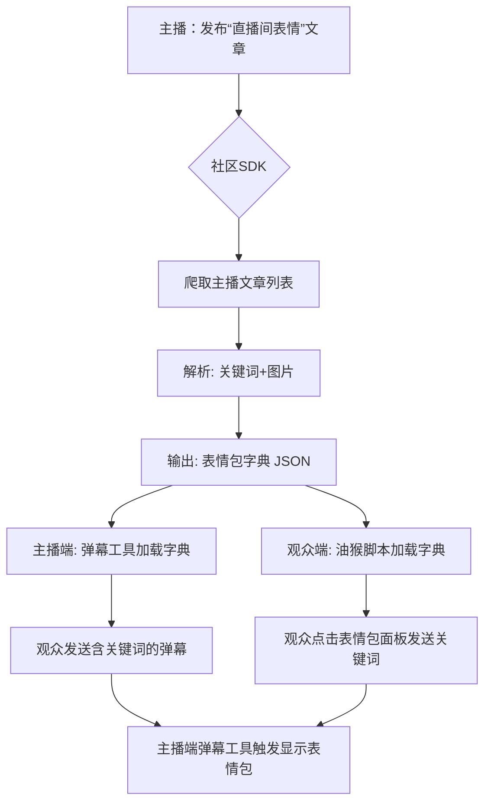

# AcFun 直播间“云表情”社区企划

> **让 AcFun 直播间的弹幕也能“斗图”！**  
> 这是一个由社区驱动的开源项目，旨在通过一种巧妙、轻量且对主播与观众都友好的方式，为 AcFun 网页直播引入“表情包弹幕”功能。

我已了解，[🚀快速开始](#-快速开始)

## 📌 项目缘起

AcFun 网页直播目前不支持主播上传自定义表情包，观众无法直接发送“图片弹幕”。  
为了解决这个问题，我们提出一种**基于主播文章**的“云表情”方案，无需平台改造，利用现有生态即可实现。

## 🎯 核心思路

我们的方案分为三步：

1.  **主播端：文章即仓库**  
    主播只需发布一篇**公开文章**，标题包含“直播间表情”，并在正文中按规范贴上**关键词+表情包图片**。  
    例如： `[蛇年AC娘_威胁]` 后面紧跟对应的表情包图片。

2.  **社区端：SDK 与工具**  
    我们提供多种语言的 **SDK** 和即用型工具，自动抓取主播的“表情包文章”，解析为 `{关键词: 图片URL}` 的字典。

3.  **用户端：无缝体验**  
    *   **主播**：使用 **AcFun 直播工具箱 MKII**、**点心 Chat** 等弹幕工具，加载字典后即可实现关键词触发“表情包弹幕”。
    *   **观众**：通过 **浏览器油猴脚本**，在弹幕输入框旁边获得一个**可视化表情包面板**，点击即可发送对应关键词，触发主播端的表情包展示。

## 📋 参与规范

为了让所有工具都能“说同一种语言”，我们制定了以下规范：

### 1. 主播文章规范

| 项目 | 规范 |
|------|------|
| **标题** | 必须包含 `直播间表情` 五个字，建议格式：`【直播间表情】你的直播间名/主题` |
| **关键词** | 用**英文方括号 `[]`** 包裹，如 `[AC娘_比心]` |
| **图片** | 关键词后的**第一张图片**将被视为该关键词对应的表情包 |
| **示例** | `[蛇年AC娘_威胁]`<br> |

> **💡 小贴士：** 建议将文章置顶，方便新观众快速了解表情包用法。

### 2. SDK 数据格式规范

所有 SDK 最终输出一个**字典（JSON 格式）**，结构如下：

```json
{
  "uid": "123456",
  "time": "2025-08-26T08:13:51Z",
  "timestamp": 1756196031,
  "emotions": {
    "[蛇年AC娘_威胁]": "https://cdn.aixifan.com/ac233.png",
    "[AC娘_比心]": "https://cdn.aixifan.com/ac666.png"
  }
}
```

## 🛠️ 技术架构



## 📦 项目仓库结构（WIP）

本仓库将作为整个企划的**主仓库**，用于协调各子项目。

```
AcfunCloudEmoji/
├── README.md                 # 本文档
├── specs/                    # 规范文档
│   ├── article-spec.md       # 主播文章撰写规范
│   ├── article-template.md   # 主播文章撰写模板
│   └── sdk-output-spec.md    # SDK 输出格式规范
├── sdks/                     # 各种语言的 SDK 实现
│   ├── csharp/
│   ├── javascript/
│   └── go/
├── userscripts/              # 浏览器用户脚本
│   └── acfuncloudemoji.user.js
├── examples/                 # 主播文章示例
└── assets/                   # 项目宣传图、Logo 等
```

## 🤝 如何参与

我们欢迎所有形式的贡献！

### 1. 作为主播
1.  在 AcFun 发布一篇符合规范的“直播间表情”文章。
2.  将文章链接分享给你的观众，并引导他们安装本项目的油猴脚本。
3.  在直播间公告或标题中加入 `#云表情` 标签，方便观众发现。

### 2. 作为开发者
1.  **Fork** 本仓库。
2.  选择你想贡献的部分：
    *   **新语言 SDK**：在 `sdks/` 下新建文件夹，如 `rust/`。
    *   **优化现有 SDK**：直接修改对应文件夹。
    *   **用户脚本**：优化 `userscripts/acfuncloudemoji.user.js`。
    *   **文档**：完善 `specs/` 或本 README。
3.  提交 **Pull Request**，我们会尽快审核合并！

### 3. 作为普通观众
1.  安装油猴脚本（Tampermonkey 等）。
2.  在支持的主播直播间使用表情包面板发送弹幕。
3.  向你喜欢的主播推荐这个企划！

## 🚀 快速开始

### 主播端
1. 发布表情包文章。查看模板：[article-template.md](specs/article-template.md)
2. 使用集成了本项目功能的弹幕软件：
   - 如果你正在使用第一代 AcFun 直播工具箱，请**手动**在工具箱中添加一致的表情包关键词与图片。
   - 如果你正在使用点心 Chat，请更新至 `v1.2.0` 及以上版本。若安装的某些应用未生效云表情功能，请积极联系作者反馈。

### 观众端（使用油猴脚本）
1.  安装 [Tampermonkey](https://www.tampermonkey.net/)。
2.  安装脚本：[](https://github.com/MiegoLive/AcfunCloudEmoji/raw/main/userscripts/acfuncloudemoji.user.js)。
    - jsdelivr 源: https://cdn.jsdelivr.net/gh/MiegoLive/AcfunCloudEmoji@main/userscripts/acfuncloudemoji.user.js
3.  进入任意支持“云表情”的主播直播间，在弹幕输入框旁即可看到表情包面板。
    - 第一次使用时会提示**一个用户脚本试图访问跨源资源**，请选择**总是允许此域名**。这是由于 `live.acfun.cn` 域名与 `www.acfun.cn` 域名不同源导致的。

## 📢 交流与反馈
*   **GitHub Issues**：发现问题或建议新功能，请直接提 [Issue](https://github.com/MiegoLive/AcfunCloudEmoji/issues)。
*   **QQ群/Discord**：待创建，请关注本仓库置顶 Issue。
*   **Acfun直播工具箱交流群**: 1063138415

## 📄 开源协议
本项目所有代码与文档均采用 [MIT License](LICENSE) 开源协议，欢迎自由使用、修改与分发。

---

## 🙏 致谢
*   感谢 [AcFun-FOSS](https://github.com/ACFUN-FOSS) 团队开发的 [AcFun Live ToolBox](https://github.com/ACFUN-FOSS/acfun-live-toolbox-MKII)，为广大 AcFun 主播提供了可靠的直播工具。
*   感谢每一位参与贡献的主播、开发者与观众，是你们让这个社区企划成为可能！

> **让我们一起，用表情包点亮 AcFun 的每一个直播间！**
